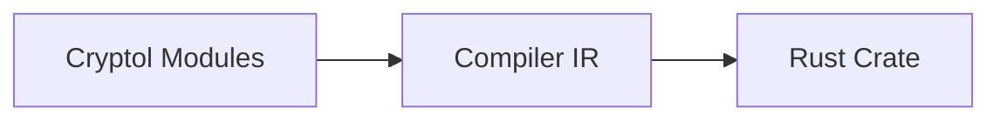

# cryptol-compiler

**NOTE:** The contents of this repo are highly experimental and subject to change.

This repository contains the source code for a compiler for the [Cryptol](https://github.com/GaloisInc/cryptol)
cryptographic specification language.  Currently the compiler can build a Rust crate from Cryptol modules, though
not all of Cryptol is supported.

For documentation on how to use the compiler, please have a look
at the [User's Guide](https://galoisinc.github.io/cryptol-compiler/index.html)

# Architecture

The compiler currently compiles Cryptol modules to an internal intermediate representation:

The design of the Compiler's IR should, in principle, allow for languages other than Rust to be
easily added as targets.  The IR is also lower-level and should also allow for the generation
of efficient code in many commonly used general-purpose programming languages.  Many target
languages of interest also do not have the support for type-level arithmetic that Cryptol has,
so the IR also serves as a way to instantiate some things that are size-polymorphic.

