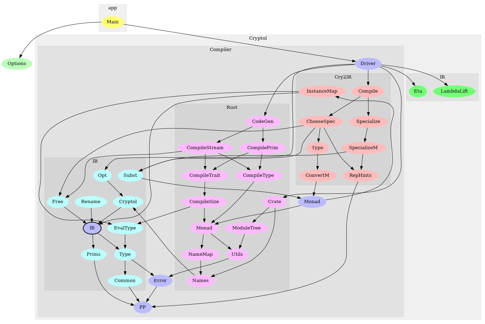

For Compiler Developers
=======================

This section describe all functions and interfaces in the compiler,
and it is aimed at developers of the compiler.

`Compiler API <_static/haddock/index.html>`_

The following diagram illustrates the dependencies between the
modules of the compiler.

